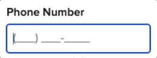

## Phone fields just got smarter
Typing a phone number now auto-formats as you type in `<nys-textinput type="tel">`.

Nice work by [Emily Gorelik](https://github.com/emilygorelik)!

## Fresh icons for better wayfinding
New additions: `mail`, `link`, `arrow_forward`, `arrow_upward`, and `arrow_downward`.  

Thanks to [Robert Chen](https://github.com/novacat35) for keeping our icon set sharp.

## Figma-only updates (engineers, you’re off the hook)

- Global Header was redesigned: better interaction, active menu states  
    → 🚨 Designers: the old version is deprecated, please swap in the new one!
- Screen template is now a published utility component. A ready-to-go starter screen for Figma — complete with header, footer, grid, and responsive layout settings.  
    → Designers: drop it in, pick a screen size, and start building.
- Visual updates to fidelity modes and input masks

That’s it!

  
### For full component updates, bug fixes, and the detailed changelog:  
[See the full developer release notes →](https://github.com/ITS-HCD/nysds/releases/tag/v1.6.0 "https://github.com/its-hcd/nysds/releases/tag/v1.6.0")