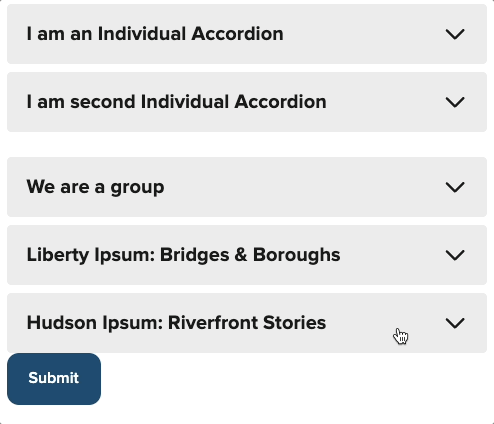

## Learn the NYS Design System
[Visit the "Learn" page](/learn) on this site to view A video tour by the NYS Design System team to help you learn how to quickly build accessible, mobile-friendly, user-friendly digital services with the Design System.

In this series, we’ll explain what a “design system” is and how ours works. Most importantly, we’ll show the value it can bring to you and to the residents that use what you build with it. Whether you’ve never used a design system before or you’re just new to ours, you’ll learn tips and ideas that will help you build better web applications and sites more quickly.

<a class="card" href="/videos/introducing-the-nys-design-system/" title="Watch Video: Introducing the NYS Design System">
              
               
                

                  
                

                

                  

                    General
                  

                  

                    Introducing the NYS Design System
                  

                  

                    Discover what the NYS Design System is, why we build it, and how it helps teams build better websites and apps.
                    
<b>Video duration: 12:49</b>

                  

                

              

            </a>

<a class="card" href="/videos/intro-to-designing-with-the-new-york-state-design-system/" title="Watch Video: Intro to Designing with the New York State Design System">
              

                

                  
                

                

                  

                    Design
                  

                  

                    Intro to Designing with the NYS Design System
                  

                  

                    Learn how to start designing in Figma with ready-to-use NYSDS libraries, tokens, components, and icons.
                    
<b>Video duration: 7:59</b>

                  

                

              

            </a>

<a class="card" href="/videos/intro-to-nysds-web-components/" title="Watch Video: Intro to NYSDS Web Components">
              

                

                  
                

                

                  

                    Development
                  

                  

                    Intro to NYSDS Web Components
                  

                  

                    Get to know our web components: what they are, how they work, and why they're built to work in any framework.
                    
<b>Video duration: 4:47</b>

                  

                

              

            </a>

## Weird Al Yankovic would be proud
Add collapsible sections to your content with [the new `nys-accordion` component](/components/accordion). You can create a one-off accordion, or group a set together. 

Robert Chen ([@novacat35](https://github.com/novacat35)) plays a mean accordion.

## Show us your badges
[The new `nys-badge` component](/components/badge) is a rounded, styled text label which can be used to display categories, tags, or other non-interactable labels for content. You can see examples of the nys-badge at the top of each page. 

Emily Gorelik ([@emilygorelik](https://github.com/emilygorelik)) knocked this out of the park!

## New icons available
New additions: `code`,  `social_bluesky`, and `social_threads`

<nys-icon name="code" size="4xl"></nys-icon>
<nys-icon name="social_bluesky" size="4xl"></nys-icon>
<nys-icon name="social_threads" size="4xl"></nys-icon>

Thanks to Robert Chen ([@novacat35](https://github.com/novacat35)) for keeping our icon set sharp.

## 🚨 Breaking Changes
 - `nys-alert` event `nys-alertClosed` changed to `nys-alert-closed` be sure to update if you are referencing the old event name.

## ⚠️ Known Issues
- [Bug: Unavheader not opening dropdowns on Safari](https://github.com/ITS-HCD/nysds/issues/812)

If you notice any issues, please add them to [our GitHub Issue Tracker](https://github.com/ITS-HCD/nysds/issues)

### That’s it!

#### For full component updates, bug fixes, and the detailed changelog:  
[See the full developer release notes for v.1.7.0 →](https://github.com/ITS-HCD/nysds/releases/tag/v1.7.0)