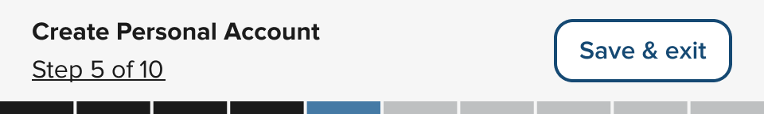
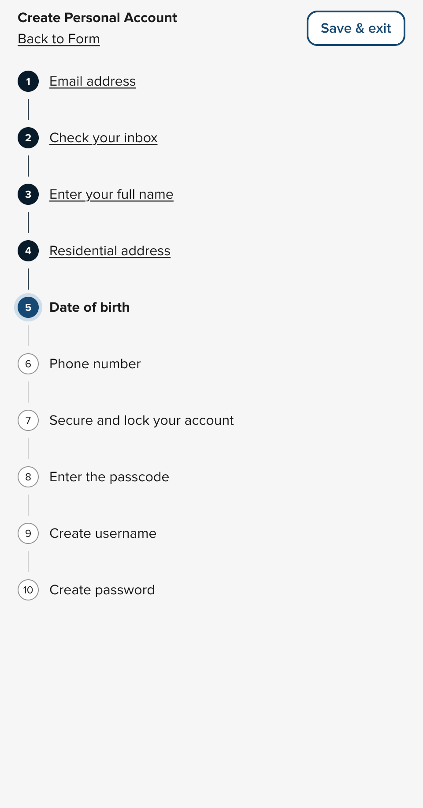
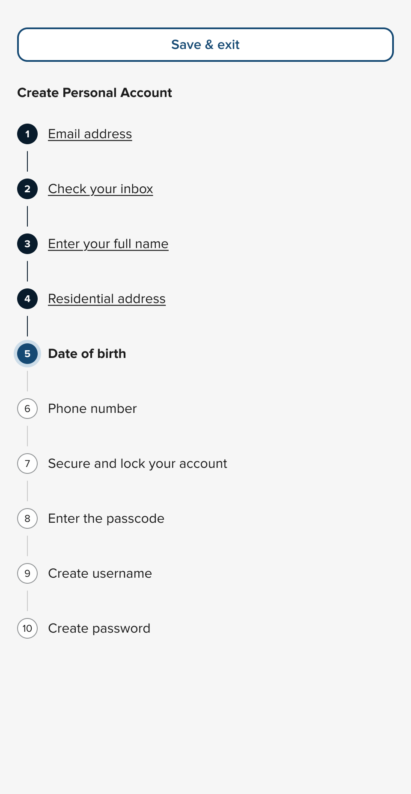

## Step by step
The new `<nys-stepper>` component helps you break down a complex process into simple steps. It is built with options to make it "dumb" (simple HREF links for steps) or "smart" (can use JS to trigger events `onClick()`). For more information, [read the full documentation for the `<nys-stepper>`](/components/stepper).

  

  <h3>Mobile</h3>
    
  

  

  <h3>Mobile Expanded</h3>
    
  

  

  <h3>Desktop</h3>
    
  

[Emily Gorelik](https://github.com/emilygorelik) poured sweat and tears into this component!

## nys-avatar has a new base color and more!
There is a new base color, new disabled and interactive properties, and logic that detects color contrast ratios to give you the best foreground color for any background color!

We have removed the `shape` property. Details can be found in the 🚨 Breaking Changes section

[Robert Chen](https://github.com/novacat35) improved the nys-avatar component.

## Moar testing
We are now automated testing in three more browsers. iPhone 14, Pixel 5, and Microsoft Edge. That brings the total number of browsers to five!

[Eric Steinborn](https://github.com/esteinborn) tests in his dreams.

## Code connect
We hooked up nys-accordion and nys-avatar to Figma's Code Connect. Copy and paste the code for these components from Figma directly into your editor of choice.

[Robert Chen](https://github.com/novacat35) connected this code.

## CSS variables shake-up
We looked at our set of CSS variables and noticed they weren't as intentional as we wanted them to be. So we took a page out of the CSS BEM (Block, Element, Modifier) syntax and have renamed our variables accordingly. We have also bubbled up some variables to be exposed to allow for certain amounts of customization depending on the component. You can find those overridable values on each component page. If you were overriding CSS variables before you'll want to check the names of those tokens to make sure they haven't changed.

[Emily Gorelik](https://github.com/emilygorelik) organized the chaos.

## Designers listen up!
 - The NYSDS Figma library has been updated to include a new `nys-divider` component. (Figma only)
 - Additional variants were added to the nys-avatar component
 - A massive Figma cleanup took place over a few months leaving a cleaner and more structured Figma library

[Kristin Sorrentino](https://github.com/ksorrentino) and [Leo Vogel](https://github.com/leo-vogel) have been delving deep into the Figma library.

## 🚨 Breaking changes
 - Removed `nys-avatar`'s `shape` property. Please remove from your applications
 - Changed `nys-alert` dispatch event from `nys-alert-closed` to `nys-close`. Please update any references to both `nys-alert-closed` and `nys-alertClosed` to `nys-close`
 - Many CSS variables were changed, too many to list, but you can [read the full changelog for CSS vars](https://github.com/ITS-HCD/nysds/pull/840)

## ⚠️ Known issues
- [Bug: Unavheader not opening dropdowns on Safari](https://github.com/ITS-HCD/nysds/issues/812)

If you notice any issues, please add them to [our GitHub Issue Tracker](https://github.com/ITS-HCD/nysds/issues)

### That’s it!

#### For full component updates, bug fixes, and the detailed changelog:  
[See the full developer release notes for v.1.8.0 →](https://github.com/ITS-HCD/nysds/releases/tag/v1.8.0)